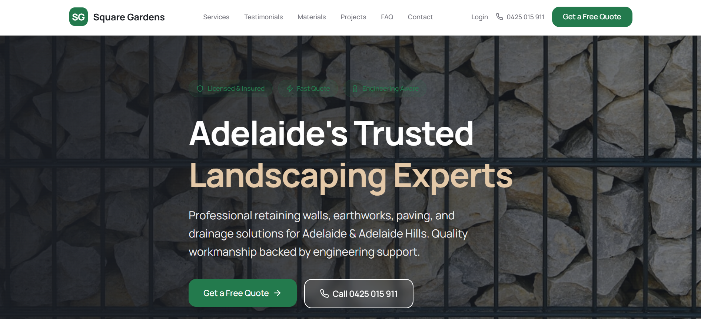
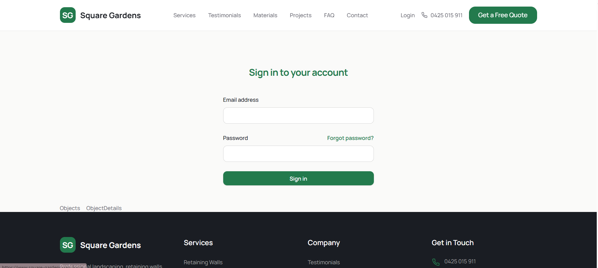
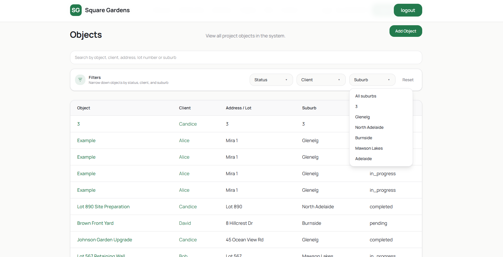
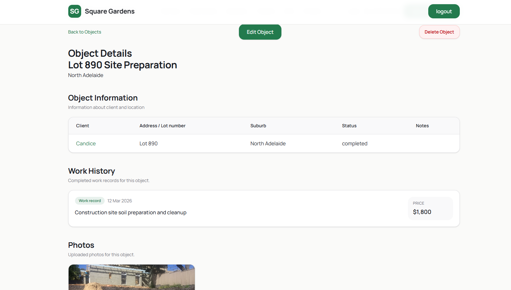
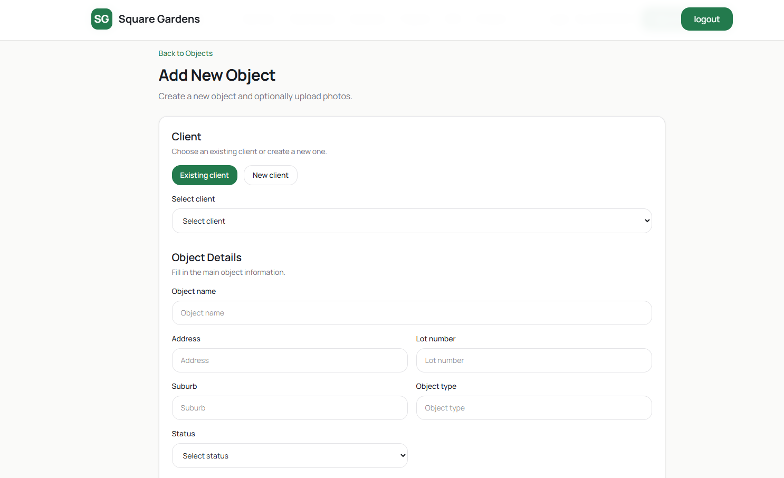
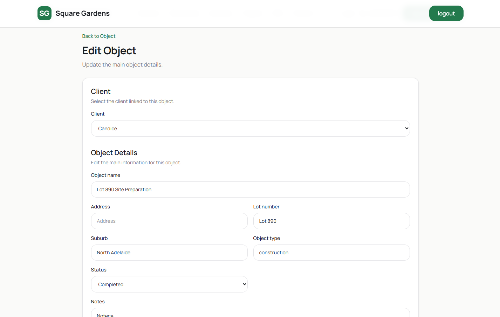
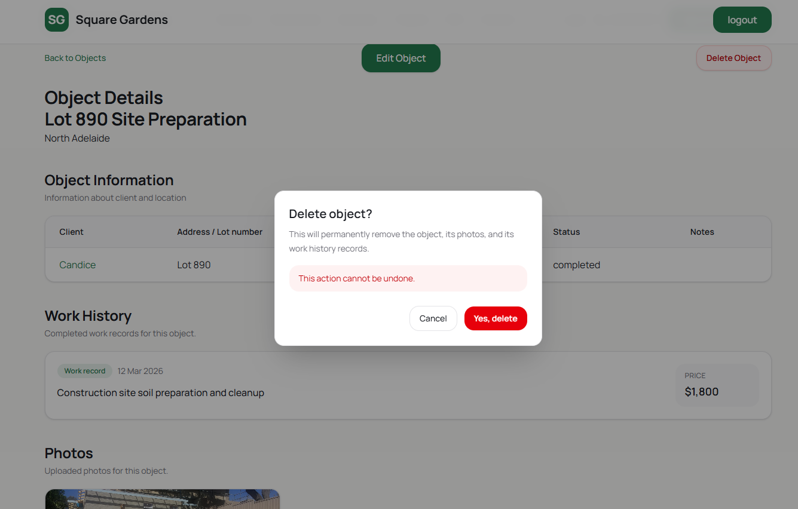
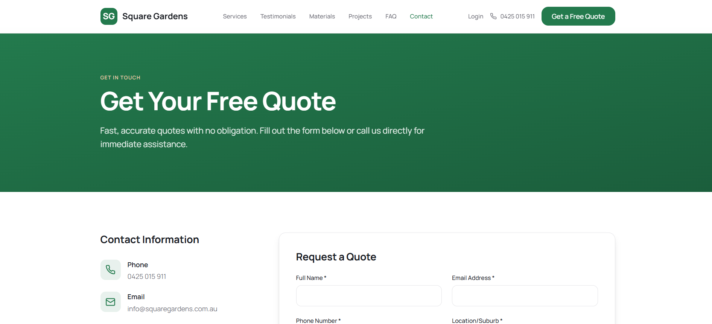

# Square Gardens Management System

> ⚠️ **Commercial Project**
>
> This repository showcases the project, technologies used, and my contribution.
> The source code is private due to commercial confidentiality.

Commercial landscape management platform developed using React, TypeScript and Supabase.

---

## 📌 Project Information

**Project Type:** Commercial Web Application

**Status:** Active Development

**Role:** Sole Full-Stack Developer

**Frontend:** React • TypeScript • Vite • Tailwind CSS

**Backend:** Supabase

**Database:** PostgreSQL

---

# Overview

Square Gardens Management System is a commercial web application developed for a landscaping company.

The project originally started as a redesign of the company's public website. During development, the client requested additional business functionality, and the project evolved into a complete management platform.

The system allows the business owner to manage clients, landscaping projects, project history, and photos through a single interface while also serving as the company's public website.

The platform is currently under active development, with employee management, payment tracking, and additional business automation planned for future releases.

---

# Who Uses the Platform

### Current Users

- Landscape company owner
- Website visitors and potential customers

### Future Users

- Employees
- Site supervisors
- Business administrators

---

# Current Features

- Secure authentication
- Public company website
- Client management
- Landscape project management
- Project history
- Photo management
- Search functionality
- Create, edit and delete projects

---

# Planned Features

- Employee management
- Payment management
- Staff activity tracking
- Role-based permissions
- Reporting dashboard
- Business workflow automation

---

# Tech Stack

### Frontend

- React
- TypeScript
- Vite
- Tailwind CSS

### Backend

- Supabase

### Database

- PostgreSQL

### Authentication

- Supabase Auth

---

# My Contribution

I was responsible for the complete software development of the platform, including:

- Designing the application architecture
- Designing the relational database
- Developing the frontend using React and TypeScript
- Implementing secure authentication
- Building CRUD functionality
- Developing client and project management
- Implementing project photo management
- Creating relationships between business entities
- Implementing search functionality
- Planning future platform scalability

---

# Engineering Challenges

Throughout development, I independently solved several engineering challenges, including:

- Designing a scalable relational database structure
- Managing relationships between clients, projects, work history, and photos
- Implementing secure authentication using Supabase Auth
- Structuring a growing React application while maintaining clean and reusable code
- Planning the architecture to support future employee and payment modules without major redesign

---

# Screenshots

## 🌐 Public Website

---

## 🔐 Login

---

## 📋 Projects List

---

## 📄 Project Details

---

## ➕ Add Project

---

## ✏️ Edit Project

---

## 🗑 Delete Confirmation

---

## 📞 Contact Page

---

# Future Development

The platform continues to evolve and the next planned features include:

- Employee management
- Payment tracking
- Role-based access control
- Reporting and analytics
- Workflow automation
- Performance improvements

---

# Note

This repository contains project documentation and screenshots only.

The source code is intentionally kept private due to commercial confidentiality.
